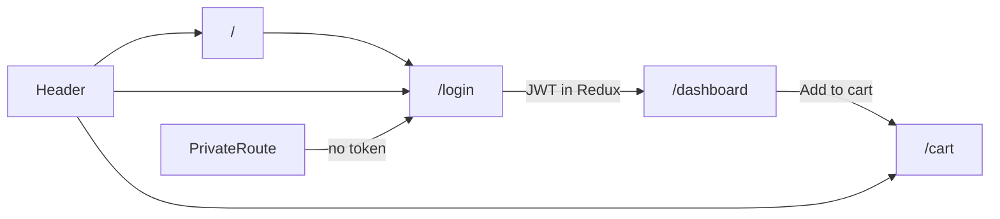

# Mini-Ecomm Client — Project Documentation

This document describes the **React frontend** under `client/src/`, how it fits the full stack, concepts you have already applied, what to study next, and known gaps to improve.

---

## 1. Project overview

**Mini-Ecomm2** is a small e-commerce learning project with:

| Layer | Location | Role |
|--------|-----------|------|
| **Frontend** | `client/` (this doc: `client/src/`) | UI, routing, client state, product browsing, cart |
| **Backend** | `server/` | Express + MongoDB: register/login, JWT |

The client is a **Vite + React 19** SPA. It uses **Redux** for auth and cart, **React Router 7** for navigation, and **SWR** for fetching the product catalog from a public API.

### Tech stack (`client/package.json`)

- **React 19** / **react-dom**
- **Vite 8** — dev server and build
- **react-router** — client-side routes
- **redux** + **react-redux** — global state (no Redux Toolkit yet)
- **swr** — data fetching and cache for products
- **lucide-react** — icons (cart, delete)

### High-level user flow



1. **Home (`/`)** — minimal landing with links (mostly superseded by the header).
2. **Login (`/login`)** — POST to local backend; stores `accessToken` in Redux.
3. **Dashboard (`/dashboard`)** — protected; loads products from [DummyJSON](https://dummyjson.com/products).
4. **Cart (`/cart`)** — protected; shows Redux cart, subtotal, delivery rule, placeholder checkout.

---

## 2. Folder structure

```
client/src/
├── main.jsx              # Entry: StrictMode, BrowserRouter, Redux Provider
├── App.jsx               # Shell: Header + AllRoutes
├── App.css               # Global + page/component styles
├── index.css             # (import commented out in main.jsx)
├── Routes/
│   └── AllRoutes.jsx     # Route definitions + PrivateRoute wrappers
├── Pages/
│   ├── Home.jsx
│   ├── Login.jsx
│   ├── Dashboard.jsx
│   └── CartPage.jsx
├── Components/
│   ├── Header.jsx
│   ├── PrivateRoute.jsx
│   ├── Product.jsx / ProductCard.jsx
│   ├── Search.jsx
│   └── Cart.jsx / CartCard.jsx
├── Redux/
│   ├── Store.jsx
│   ├── Auth_Reducer/     # Action.jsx, Reducer.jsx
│   └── Cart_Reducer/     # Action.jsx, reducer.jsx
└── services/
    └── API.jsx           # SWR fetcher helper
```

**Convention notes:**

- **Pages** = route-level screens.
- **Components** = reusable UI pieces.
- Redux split by feature (`Auth`, `Cart`) with action type constants in `Action.jsx`.

---

## 3. Architecture in detail

### 3.1 Application bootstrap (`main.jsx`)

- Wraps the app in `BrowserRouter`, `Provider` (Redux `Store`), and `StrictMode`.
- Styles: only `App.css` is loaded globally (`index.css` is not imported).

### 3.2 Routing (`Routes/AllRoutes.jsx`)

| Path | Component | Access |
|------|-----------|--------|
| `/` | `Home` | Public |
| `/login` | `Login` | Public |
| `/dashboard` | `Dashboard` | `PrivateRoute` |
| `/cart` | `CartPage` | `PrivateRoute` |

`PrivateRoute` reads `state.Auth.isAuth` and `state.Auth.accessToken`. If either is missing, it redirects to `/login` with `replace`.

### 3.3 Redux store (`Redux/Store.jsx`)

- **`legacy_createStore`** + **`combineReducers`** (classic Redux, not RTK).
- Slices:
  - **`Auth`**: loading/error flags, `isAuth`, `accessToken`.
  - **`Cart`**: `cart_data` — array of product objects from DummyJSON.

Redux DevTools supported via `window.__REDUX_DEVTOOLS_EXTENSION_COMPOSE__`.

### 3.4 Auth flow (`Pages/Login.jsx` + `Auth_Reducer`)

1. User submits email/password.
2. Dispatch `Login_Request` → `isLoading: true`.
3. `fetch` POST `http://127.0.0.1:5000/api/v1/auth/login`.
4. On success: `Login_Success` with `payload.Token` → navigate to `/dashboard`.
5. On failure: `Login_Failure` with error message.

**Important:** The JWT is stored only in **memory (Redux)**. Refreshing the page logs the user out. The token is **not** sent on subsequent API calls (products come from DummyJSON, not your server).

### 3.5 Products (`Pages/Dashboard.jsx`)

- **SWR** key: `` `https://dummyjson.com/products` `` + `fetcher` from `services/API.jsx`.
- Loading/error UI is basic text.
- Renders `Product` → grid of `ProductCard`.

### 3.6 Cart (`Cart_Reducer` + `Cart.jsx`)

- **Add:** `Add_Cart` — appends product if `id` not already in cart (no quantity increment).
- **Remove:** `Remove_Cart` — filter by `id`.
- **Clear:** `Clear_Cart` — on logout in `Header.jsx`.

**Checkout sidebar logic (`Cart.jsx`):**

- Subtotal: sum of `Math.floor(price)` per item.
- Delivery: ₹30 if subtotal ≥ 50, else 0 (business rule is hard-coded).
- **Place Order** button has no handler yet.

### 3.7 Header (`Components/Header.jsx`)

- Logo, Home link, `Search` (UI only), cart link with badge count, Login/Logout.
- Logout dispatches auth logout + clear cart.

### 3.8 API layer (`services/API.jsx`)

```js
export const fetcher = (...args) => fetch(...args).then(res => res.json())
```

Single shared fetcher for SWR. Login uses inline `fetch` in `Login.jsx` (not centralized).

### 3.9 Backend contract (for context)

The server (`server/app.js`) exposes:

- `POST /api/v1/auth/register` — not wired in the UI yet.
- `POST /api/v1/auth/login` — returns `{ accessToken }` on success.

MongoDB stores hashed passwords (`bcrypt`). JWT is signed with a hard-coded `'secret_key'` on the server (a server-side improvement item).

---

## 4. What you have learned (mapped to this codebase)

Use this as a checklist of skills already demonstrated in the repo:

| Topic | Where it shows up |
|--------|-------------------|
| **React function components & hooks** | `useState` in Login; `useDispatch`, `useSelector` across app |
| **Controlled forms** | Login email/password state |
| **Client-side routing** | `AllRoutes`, `Link`, `Navigate`, `useNavigate` |
| **Route guards** | `PrivateRoute` pattern |
| **Classic Redux** | Actions, reducers, `combineReducers`, immutable updates |
| **Feature-based state** | Separate Auth vs Cart reducers |
| **Async login flow** | try/catch, dispatch success/failure |
| **Data fetching library** | SWR + loading/error states on Dashboard |
| **Lists & keys** | Product grid, cart list |
| **CSS layout** | Flex/grid in `App.css` (header, product cards, cart) |
| **Third-party UI** | lucide-react icons |
| **Full-stack auth basics** | Client login + Express JWT (conceptually) |

---

## 5. What to focus on next (learning path)

Ordered suggestions that build directly on this project:

1. **Redux Toolkit (RTK)** — Replace `legacy_createStore` and manual action types with `createSlice`, `configureStore`. Less boilerplate, easier to maintain.
2. **Persist auth (and optionally cart)** — `localStorage` + rehydrate on load, or `redux-persist`. Understand refresh vs security (XSS and token storage tradeoffs).
3. **Centralize HTTP** — One `apiClient` module: base URL from env (`VITE_API_URL`), attach `Authorization: Bearer` for protected routes.
4. **Use your backend for products/orders** — Move from DummyJSON to your own API; practice CRUD and authenticated requests.
5. **Environment variables** — Vite `import.meta.env.VITE_*` instead of hard-coded `http://127.0.0.1:5000`.
6. **Forms & UX** — `type="password"`, validation messages, disable submit while `isLoading`, show `Auth.Error` on Login.
7. **Search & filters** — Wire `Search.jsx` to URL query params or local state; filter SWR data or call DummyJSON search API.
8. **Cart enhancements** — Quantity per line item, persist cart, duplicate handling strategy (increment vs block).
9. **TypeScript** — Gradual migration starting with Redux types and API responses.
10. **Testing** — React Testing Library for Login and cart reducers; optional MSW for API mocks.

---

## 6. Improvements needed (prioritized)

### Critical / correctness

| Issue | Detail |
|--------|--------|
| **No auth persistence** | Page reload clears token; poor UX for a real app. |
| **JWT unused after login** | Token never attached to requests; protected backend routes would not work yet. |
| **Login error UX** | `Login_Failure` sets `Error` in Redux but Login UI does not display it. |
| **Password field** | Login uses `type="text"` for password — should be `password`. |
| **HTTP status handling** | Login treats missing token as failure but does not check `response.ok` or server error messages. |

### Consistency & maintainability

| Issue | Detail |
|--------|--------|
| **Naming** | `Add_cart` vs `Add_Cart`; `HandleChange` PascalCase vs typical `handleChange`. |
| **File name casing** | `Store.jsx` imports `./Auth_Reducer/reducer` but file is `Reducer.jsx` — can break on Linux/macOS case-sensitive filesystems. |
| **Duplicate action patterns** | Auth reducer uses string literals in `switch`; Cart uses same — prefer constants everywhere (Auth already exports `Action_Type`). |
| **API URLs scattered** | Login hard-codes backend URL; Dashboard uses external DummyJSON. |
| **Currency mismatch** | `ProductCard` shows ₹; `CartCard` shows `$`. |

### Features incomplete

| Item | Status |
|------|--------|
| **Search** | Input only; no state or filtering. |
| **Register** | Server endpoint exists; no client page. |
| **Place Order** | Button with no logic or API. |
| **Home page** | Minimal; product discovery starts only after login on Dashboard. |
| **Cart without login** | Cart route is protected; badge visible when logged out — acceptable, but adding items requires dashboard access. |

### Security & production (client-relevant)

| Item | Note |
|------|------|
| **Token in Redux only** | Better than localStorage for XSS in some debates, but you still need a deliberate strategy (httpOnly cookies vs memory + refresh tokens). |
| **CORS / backend** | Server allows `origin: "*"` — fine for learning; tighten for production. |
| **No `.env` in client** | Document required env vars when you add them. |

### Code quality

| Item | Suggestion |
|------|------------|
| **Empty cart state** | Cart page when `cart_data` is empty — no empty-state message. |
| **Accessibility** | Buttons wrapping `Link` on Home; prefer styled `Link` or `nav` semantics. |
| **index.css unused** | Either use it for resets/variables or remove dead file. |
| **ESLint** | Run `npm run lint` regularly; consider stricter rules as the app grows. |

---

## 7. Redux reference (quick)

### Auth actions (`Redux/Auth_Reducer/Action.jsx`)

- `Login_Request`, `Login_Success`, `Login_Failure`, `Logout`

### Cart actions (`Redux/Cart_Reducer/Action.jsx`)

- `Add_Cart`, `Remove_Cart`, `Clear_Cart`

### Selectors in use

- `state.Auth` — `isAuth`, `accessToken`, `isLoading`, `isError`, `Error`
- `state.Cart.cart_data` — array of products

---

## 8. Running the client (local dev)

From `client/`:

```bash
npm install
npm run dev
```

For login to work, start the backend from `server/` (MongoDB connection required per `server/config.env`) on port **5000**.

Build for production:

```bash
npm run build
npm run preview
```

---

## 9. Suggested milestone roadmap

Short milestones to turn this learning project into a fuller mini e-commerce app:

1. **M1 — Auth UX** — Password input, error display, loading on submit, optional register page.
2. **M2 — Persist session** — Rehydrate auth (and decide cart persistence).
3. **M3 — API layer** — Env-based base URL, auth header helper, unified error handling.
4. **M4 — Catalog** — Search working; optional categories from DummyJSON or your API.
5. **M5 — Cart v2** — Quantities, empty states, consistent currency/formatting.
6. **M6 — Orders** — Place order API + order history page.
7. **M7 — Hardening** — RTK migration, TypeScript, tests, deploy (e.g. Vercel + Render/Railway for API).

---

## 10. Summary

This client is a solid **learning foundation**: routing, guarded routes, classic Redux for auth and cart, and SWR for remote product data. The main gap between “tutorial” and “product-like” is **persistence**, **centralized API/auth headers**, **completed flows** (register, search, checkout), and **polish** (errors, accessibility, consistent styling).

Keep the same folder layout (Pages / Components / Redux / services) as you grow; evolve Redux toward RTK and extract HTTP into `services/` as the next structural win.

---

*Last updated to reflect the codebase structure and behavior in `client/src/`.*